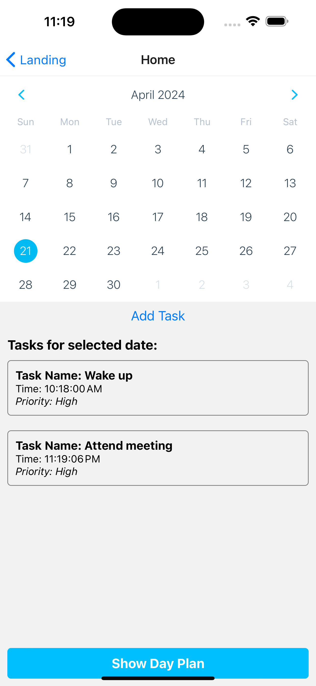

# Day Planner App

## Student-1

**Name**: Hema Ponganti

**Email**: ponagaha@mail.uc.edu
## Student-2

**Name**: Tulasiram Nakkanaboina

**Email**: nakkantm@mail.uc.edu

## Student-3

**Name**: praneeth reddy karra

**Email**: karrapy@mail.uc.edu

**Overview**: we have designed an app to assist users to stay productive and organized throughout their day. This app helps the users to organize and manage their daily tasks and schedules effectively.

The key features of DayPlanner App are:

1) Creation of Tasks: App users can login and create tasks with details required such as name of the task , time , and priority of the task.. This allows the users to give information about each specific task they have to perform
2) Date selection: A calendar componenet has been incorportated in this app which allows the users to select date for creating their tasks, This ensures that the tasks are organized on daily basis that have to be completed.
3) Day planning: Users can plan their day , this screen displays all the tasks scheduled for the selected date. These are displayed in the chronological order making it feasible for the users to see based on the time and priority.
4) Task Management : User can add , edit and delete the tasks. Users will also be able to complete these tasks as completed once they are finished. so the users can keep track of their progress.
5) This app has a user-friendly interface with easy navigation and visually appealing design .It utilizes components such as buttons, calendars, and dialogs to provide a seamless user experience.

Going forward we want to integrate machine learning models into this application which generates a diary entry at the end of the day based on the number of tasks the user has completed . The user can use this dairy as a memory or a feedback and refelect on it to perform better the next day.
 
**components**
On opening the app the users are greeted with the Home Screen 
###Calendar Component: 
On the home screen calender componenet is displayed which  allows users to select  specific date.
###Add Task Button:
 "Add Task" button enables users to create new tasks for the selected date .
###Task Form: 
on clicking "Add Task" button a task form is opened where the users can input details such as task name , time , and priority .
###Task List: 
 A scrollable list of  all tasks scheduled are displayed for the selected date. Each task is presented with its name , time, and priority .
###Show Day Plan : 
"ShowDay Plan" button in the bottom of the screen . Clicking which redirects users to the Day Plan Screen , where they can view all tasks scheduled for the selected date in chronological order .

**Languages used**: JavaScript
**Platform used**: Visual Studio

